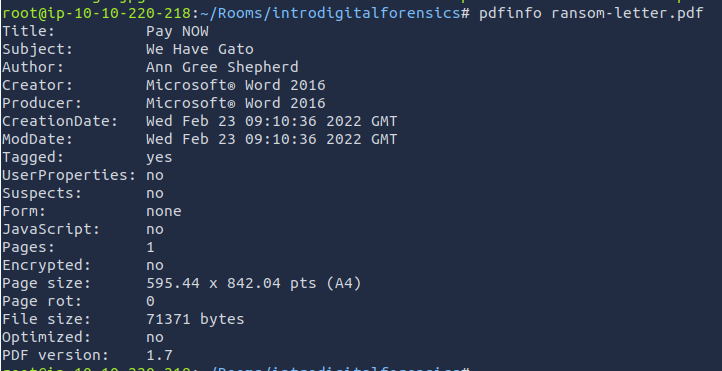
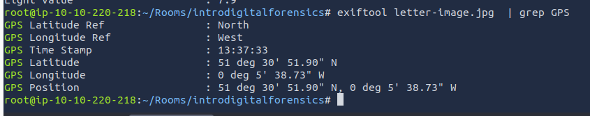
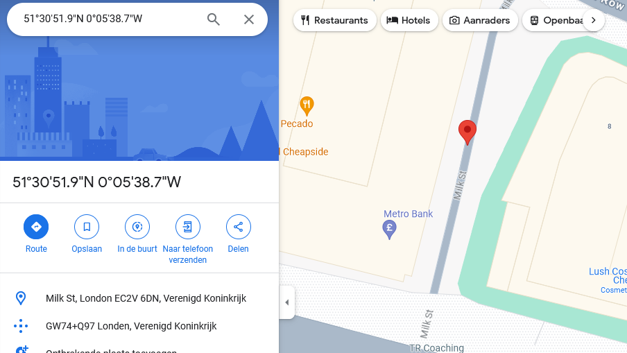
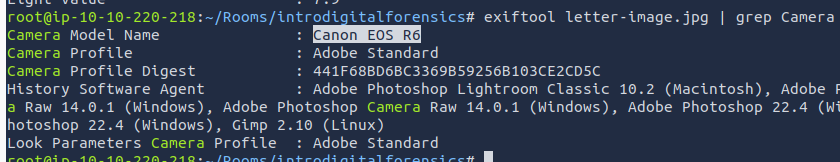

# Intro to Digital Forensics
Digital Forensics is the application of computer science to investigate digital evidence for legal purpose.
Used in two types of investigations:
- **Public-sector investigations**: Carried out by government and law enforcement agencies. part of a crime or civil investigation.
- **Private-sector investigations**: Carried out by corporate bodies, assigning private investigators, triggered by corporate policy violations.

## Digital Forensics Process
As a forensics investigator arriving on a crime scene the basic plan goes as follows (after proper authorization):
1. **Acquire evidence**: Collect digital devices such as laptops, storage devices, smartphones.
2. **Establish chain of custody**: Fill out the related forms, to ensure only authorized investigators had access and evidence cant have been tampered with.
3. **Place evidence in secure container**: You want to ensure that the evidence does not get damaged and cant access the network so they don't get remotely wiped
4. **Transport evidence** to digital forensics lab.

At the lab:
1. **Retrieve evidence** from secure container.
2. **Create forensic copy of the evidence**: This requires advanced software to avoid modifying original data.
3. **Return evidence to the secure container**: You will be working with the copy, in case of damage you can always make a new one.
4. **Start processing the copy**.

Extra notes;
- **Proper search authority**: Investigators cannot commence without the proper legal authority.
- **Chain of custody**: This is necessary to keep track of who was holding the evidence at any time.
- **Validation with mathematics**: Using a special kind of mathematical function, called a hash function, we can confirm that a file has not been modified.
- **Use of validated tools**: The tools used in digital forensics should be validated to ensure that they work correctly. For example, if you are creating an image of a disk, you want to ensure that the forensic image is identical to the data on the disk.
- **Repeatability**: The findings of digital forensics can be reproduced as long as the proper skills and tools are available.
- **Reporting**: The digital forensics investigation is concluded with a report that shows the evidence related to the case that was discovered.

## Practical Example:
Everything we do on digital devices, leaves traces...

```
Our cat, Gado, has been kidnapped. The kidnapper has sent us a document with their requests in MS Word Document format. We have converted the document to PDF format and extracted the image from the MS Word file for your convenience.
```

### Document Metadata
When creating a text file, the OS saves **metadata** such as: file creation date, last modified, etc.
We will use the software `pdfinfo` to read some of the metadata here:
(this can be installed on Kali under `sudo apt install poppler-utils` )


### Photo EXIF Data
**EXIF** (**Ex**changeable **I**mage **F**ile Format) is a standard for saving image metadata.
Examples of the metadata found in digital images would be:
- Camera Model / Smartphone model
- Date & Time of image capture
- Photo settings eg. focal length, shutter speed, ISO
- GPS Coords.

we'll be using `exiftool` here (install through `sudo apt install libimage-exiftool-perl`)
to read the embedded metadata.

(important information caught in `grep` as there is A LOT otherwise)


(replacing `deg` with `°` and stripping spaces)

And the Camera it was taken with:
