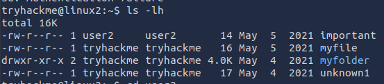

`file <filename>` to get info on what kind of file it is
`history` for command history for the user

#### How **`2>`** works:
File descriptor `2` represents standard error. (other special file descriptors include `0` for standard input and `1` for standard output).
`2> /dev/null` means to redirect standard error to `/dev/null`. 
`/dev/null` is a special device that discards everything that is written to it.

`ls -lh` to list files in the directory

The first three columns are important in determining characteristics of a file or folder.
They show which actions are possible and what user or group has the ability for this;
actions such as:
- read
- write
- execute

example above, user2 can read and write the file `important`
however `myfolder` has a `d` flag, indicating it's a directory

### SSH file transfer (SCP)
Uploading a file (you --> target)
`scp <local_file> <user>@<ip address>:<path_to_store_the_file>`
example: `scp important.txt ubuntu@192.168.1.30:/home/ubuntu/transferred.txt`

Downloading a file (you <-- target)
`scp <user>@<address>:<remote_file_location> <filename_to_store>`
example: `scp ubuntu@192.168.1.30:/home/ubuntu/documents.txt notes.txt`

Serving files from your Host
Using Python3 (standard on many linux distro's) we can set up a lightweight HTTPServer
Then we can use `curl` or `wget` to download these files remotely.
simply run `python3 -m http.server`
Then you can simply do something like: `wget http://10.10.134.212:8000/myfile

### Processes 101
using the `ps` command lists processes for our user's session along with a status code, PID, CPU usage etc. and the name of the program

to see processes of other users use the `aux` switch like: `ps aux`
Another useful command is: `top`, for real-time statistics of the system's processes (refreshes every 10 seconds or with movements)

If we want to stop a process we can do that with `kill <PID>`

starting a program on boot: `systemctl <option> <service>`
for example to tell apache to start we'll use `systemctl start apache2`
there are 4 options  for systemctl
- start
- stop
- enable
- disable
enable/disable is to make it a 'startup' task, so it runs on the boot-up

to run a task in the background we can add an `&` ; example `echo "hi" &`
to push a process away from the foreground we can do  `Ctrl+Z`, to bring it back we use `fg` in the terminal

### Automating tasks:
https://crontab-generator.org/
https://crontab.guru/

An example where we back up our Documents folder every 12 hours
`0 */12 * * * cp -R /home/cmnatic/Documents /var/backups/`
Cron supports wildcards or asterisk (`*`)  for the fields we dont care about

Crontabs can be edited using `crontab -e`

### System Package Management
Additional repositories can be added using `add-apt-repository`

An example on adding a new package (In this case for SublimeText)
First off, we need to add the GPG key
`wget -qO - https://download.sublimetext.com/sublimehq-pub.gpg | sudo apt-key add -`
It is good practice to have separate file for every community/3rd party repository you add.
this is done in the `/etc/apt/sources.list.d` directory
- Make new file: `touch sublime-text.list`
- in that file we add `deb https://download.sublimetext.com/ apt/stable/`
- after saving and closing that, we run `apt update` to include the new entry
now we can run `apt install sublime-text`

removing packages
this is done by either `add-apt-repository --remove ppa:PPA_Name/ppa` or by doing `apt remove [software-name-here]`

### Logs
these are located in the `/var/log` directory

Some are more interesting than others
there are logs such as `fail2ban` which is used to monitor attempted brute forces
the `UFW` service, which is used as a firewall.
`
___
# Common Directories

### **/etc**
this root directory is a commonplace location top store system files used by the operating system. for example the `sudoers` file, containing a list of users & groups that have permissions to run sudo or a set of commands as root user.

Also home to the `passwd` and `shadow` file, that store the passwords for each user in an encrypted format (sha512crypt)
### **/var**
This folder stores data frequently accessed or written by services or applications on the system, such as log files `/var/log` or other data not linked to a specific user (eg. databases)
### **/root**
unlike the `/home` directory, this folder is the actual home for our `root` user
### **/tmp**
this is a volatile directory, used to store data that is only temporary needed, this folder is cleared out on system restarts.
This folder is useful for pentesting cause any user can write here, so we can store our enumeration scripts here.
