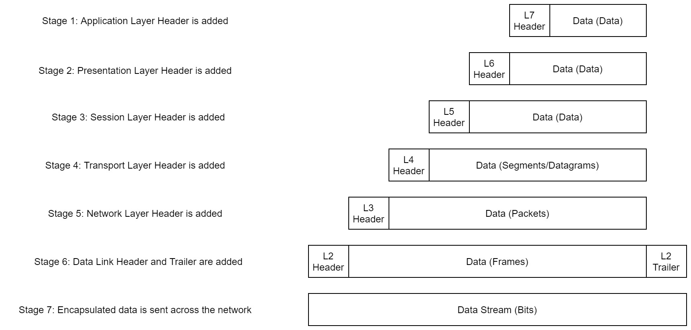

# OSI Model
**(In-depth: [[OSI Model]])**
Is a standardized model consisting of **7 Layers**.
Used to demonstrate theory behind computer networking.

#### OSI:
- 7. Application
- 6. Presentation
- 5. Session
- 4. Transport
- 3. Network
- 2. Data Link
- 1. Physical
#### Application
Provides networking options to programs running on a computer, provides an interface for them to use for transmitting data. This is passed down to the Presentation layer.
#### Presentation
Receives data translates the data from the application into a standardizes format also handles encryption, compression and other transformations. Afterwards this is passed down to the session layer.
#### Session
Try's to set up a connection with the other computer and maintains this, returns an error if it fails.
On successful connection, the data is passed down to the transport layer.
#### Transport
Chooses protocol for transmission most commonly: 
**TCP** (**T**ransmission **C**ontrol **P**rotocol) or **UDP** (**U**ser **D**atagram **P**rotocol)
once a protocol is selected the data is split into smaller pieces.
either **segments** for **TCP** or **datagrams** for **UDP**.
#### Network
Locates the destination of your request - works with *Logical* addressing (eg. IP Addresses, IPv4)
#### Data Link
focuses on physical addressing the packet from the network layer by adding a physical (**MAC**) address of the receiving endpoint.
Inside every network enabled computer is a Network Interface Card (**NIC**),
which comes with a unique **MAC** (**M**edia **A**ccess **C**ontrol) address to identify it with
When receiving data it also checks to make sure it hasn't been corrupted.
#### Physical
This is the hardware, it sends electrical pulses that make up the data transfer.
It also converts the binary data of the transmission data into signals and transmits them across the network as well as receiving incoming signals and converting them back into binary data.
### Encapsulation

# TCP/IP Model
### TCP/IP
- Application
- Transport
- Internet
- Network Interface

### OSI ~ TCP/IP

TCP is a *connection-based* protocol, before it's able to send data it must first establish a connection this process is called a **three-way handshake**

### Three-way handshake
**Syn**: syn bit short for *synchronise*. makes first contact in the connection process.
**Syn/Ack**: the server response. with a **Syn** bit and an **Ack** bit for *acknowledgement*
**Ack**: Reply with an *acknowledgement* bit to complete the handshake

# DNS
***DNS*** (**D**omain **N**ame **S**ystem) is a TCP/IP Protocol.

When making a request to a website first it will check its local "Hosts File" in case there is an explicit mapping set Otherwise your computer will send a request to a recursive DNS server.

***recursive* DNS** server.
if the requested domain is not popular (and thus not cached) it will pass this on to a *root name server*.

***root name*** servers keep track of DNS servers in the next level down. these lower level servers are called *Top-Level Domain*

***Top-Level Domain*** each handle their own extensions such as `.com`, `.be`, `.co.uk`, etc. Afterwards they pass it down Authoritative name servers,

***Authoritative name*** servers, these store DNS records for domains directly.
When your request reaches this server it will send the relevant information back to you allowing you to connect to the IP address behind the requested domain.

##### DNS Server types
- Recursive DNS Server
- Root name server
- Top-Level Domain server
- Authoritative name server

### DNS In detail

#### Domain Hierarchy
##### TLD (Top-Level Domain)
there are 2 types of TLD
- gTLD (Generic Top Level)
- ccTLD (Country Code Top Level)

historically, gTLD was meant to tell the purpose of a domain; for example `.com` for commercial, `.org` for organisation, `.edu` for education and `.gov` for government.
Meanwhile ccTLD was for geographical purposes, `.ca` for Canada, `co.uk` for United Kingdom etc.
Due to demand, there's an influx of new gTLDs such as `.online`, `.club`, `.biz`, etc.
for a full list of over [2000 TLDs, here](https://data.iana.org/TLD/tlds-alpha-by-domain.txt)
##### Second-Level Domain
taking `tryhackme.com` as an example, the `.com` is part of the TLD, and `tryhackme` is part of the Second Level Domain.
When registering a SLD, it is limited to 63 characters + the TLD, and can only use a-z, 0-9 and hyphens (can not start or end with hyphens or have consecutive hyphens).

##### Subdomain
a subdomain sits on the left-hand side of a SLD, using a period to separate it. for example `admin.tryhackme.com` the admin part is the subdomain here.
It has the same restrictions as the SLD, you can use multiple subdomains split with periods
such as `jupiter.servers.tryhackme.com` but the length must be kept under 253 characters.
There is no limit on subdomains.

#### Record Types
DNS isn't just for websites, multiple types of DNS record exist.
The most common ones are
- **A Record** : These resolve to IPv4 addresses - example `104.26.10.229`

- **AAAA Record** : These resolve IPv6 addresses - example `2606:4700:20::681a:be5`

- **CNAME Record** : these resolve to another domain name - example `store.tryhackme.com` which returns a CNAME record `shops.shopify.com` a follow-up request to `shops.shopify.com` for it's will be made.

- **MX Record** : These resolve to the address of the servers that handle the email domain you're querying example an MX record response for `tryhackme.com` would look something like `alt1.aspmx.l.google.com`. These records also come with a priority flag. This tells the client in which order to try the servers, this is perfect for if the main server goes down and email needs to be sent to a backup server.

- **TXT Record** : are free text fields for any text-based data, common uses can be to list servers that have to authority to send email on behalf of said domain (helps with spam/spoofed emails) also used to verify ownership of the domain when signing up for third-party services

#### Making a request

1. When requesting a domain name, first your computer checks its local cache, if not there a request to a Recursive DNS Server is made.
2. A Recursive DNS server, has a local cache of recently looked up domains, if its found locally this is sent back (common ex; Google, Facebook, Twitter). These are commonly provided by your ISP. If the domain is not found locally it sends it to the Root DNS Server
3. The Root servers act as a backbone, their job is to redirect to the correct Top-Level Domain server (eg `.com`)
4. The TLD server holds records on where to find the authoritative server to answer the DNS requests, often known as nameservers for the domain (eg. [tryhackme.com](http://tryhackme.com) 's nameservers are [kip.ns.cloudflare.com](http://kip.ns.cloudflare.com) and [uma.ns.cloudflare.com](http://uma.ns.cloudflare.com)) these often have multiple, as a backup.
5. Authoritative DNS server is responsible for storing DNS records of a particular domain name. Any updates to the domain name's DNS records would be made here. depending on the record type, the DNS Record send back to the recursive DNS server (where a local copy is cached) is then relayed to the original client that made the request. DNS records all come with a TTL (Time To Live) in seconds, this is how long they stay cached before having to be looked up again.

---
[[LAN Networks]] | [[Security & Tools]]
