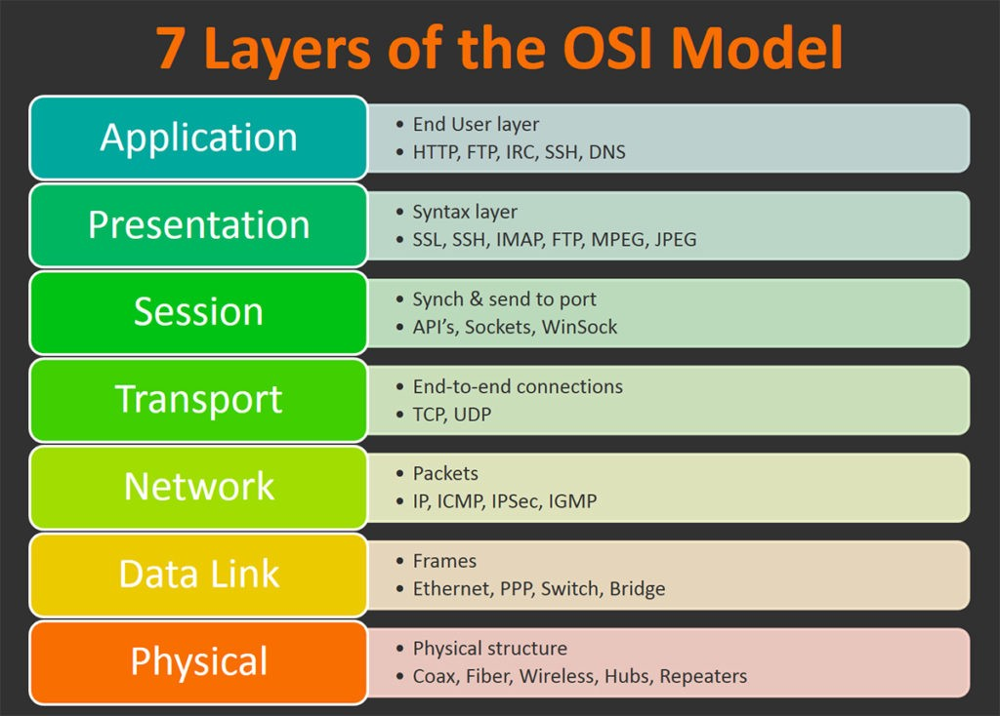

# What is the OSI Model?
The **OSI** model (**O**pen **S**ystems **I**nterconnection Model) is a critical model, providing a framework on how all networked devices send, receive and interpret data.

The OSI model is made up of 7 layers, each with their own set of responsibilities and is arranged from **Layer 7 (Application)** to **Layer 1 (Physical)**.

At each layer data passes through, various processes occur, and additional information is appended. This phenomenon is called **encapsulation**

# Layer 7 - Application
The **application layer** of the OSI model *facilitates user interaction* with data through protocols and rules. 
This layer is familiar due to everyday *applications* like email clients, browsers, and file server browsing software (e.g., FileZilla) offering a **GUI** (**G**raphical **U**ser **I**nterface).
Protocols such as **DNS** (**D**omain **N**ame **S**ystem) translate website addresses into IP addresses.
# Layer 6 - Presentation
This layer initiates *standardization*, ensuring consistent data handling regardless of software variations. 
Serving as a *translator* between the application layer (layer 7) and lower layers, it ensures *data compatibility* even if received by different applications. *Security* measures like *data encryption* (e.g., HTTPS) are implemented at this layer.
# Layer 5 - Session
The **session layer** (layer 5) establishes and manages connections between computers, *creating sessions* for data exchange. 
It ensures *synchronization* and breaks data into *smaller packets for transmission*, reducing data loss risks. Sessions are unique, restricting data transmission to within each session.
# Layer 4 - Transport
# Layer 3 - Network
# Layer 2 - Data Link
# Layer 1 - Physical
