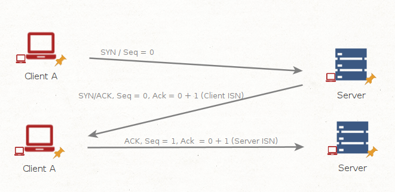
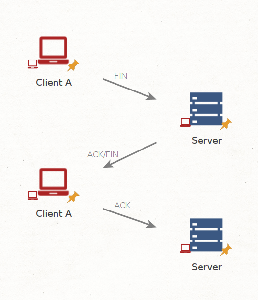
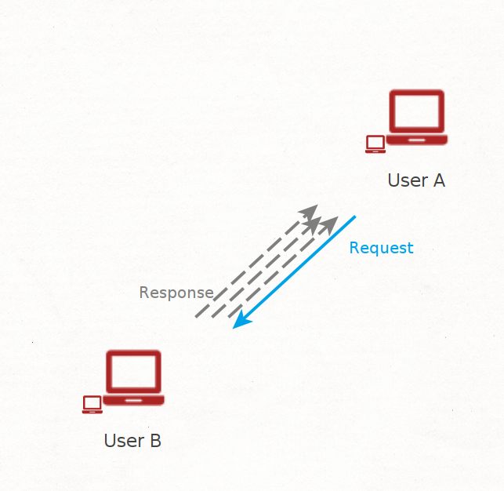

# What are Packets and Frames
**Packets** and **frames** are small data units that compose larger messages.
In the OSI model, frames reside at layer 2, the *data link layer*, without IP addresses. 
**Encapsulation**, likened to envelopes within envelopes, illustrates this distinction: packets encapsulate data, while frames contain data within the network.

When discussing IP addresses, we refer to packets; frames represent the data link layer. Using packets enhances network communication efficiency, reducing the risk of bottlenecks compared to sending large messages. 
For instance, when loading an image from a website, it's transmitted in packets, reconstructed on the recipient's device.

Packets vary in structure based on their type. Networking relies on standards and protocols to govern packet handling on devices. With an estimated 50 billion connected devices by 2020, standardization is crucial. For instance, in the *Internet Protocol*, packets include *headers containing extra information* alongside the data transmitted across a network.

Some notable headers include:

| **Header**          | **Description**                                                                                                                                                         |
| ------------------- | ----------------------------------------------------------------------------------------------------------------------------------------------------------------------- |
| Time to Live        | This field sets an expiry timer for the packet to not clog up your network if it never manages to reach a host or escape!                                               |
| Checksum            | This field provides integrity checking for protocols such as TCP/IP. If any data is changed, this value will be different from what was expected and therefore corrupt. |
| Source Address      | The IP address of the device that the packet is being sent **from** so that data knows where to **return to**.                                                          |
| Destination Address | The device's IP address the packet is being sent to so that data knows where to travel next.                                                                            |
# TCP/IP (The Three-Way Handshake)
**TCP**, short for **T**ransmission **C**ontrol **P**rotocol, functions as a set of networking rules.
It parallels the OSI model with its four-layer structure: *Application, Transport, Internet, and Network Interface*.
Similar to the OSI model, each layer in TCP adds information as data traverses it, a process known as encapsulation. 
TCP is connection-based, requiring a connection establishment between client and server before data transmission. This ensures reliable data delivery, facilitated by the **Three-way handshake process**. 

| **Advantages of TCP**                                                                                       | **Disadvantages of TCP**                                                                                                                                              |
| ----------------------------------------------------------------------------------------------------------- | --------------------------------------------------------------------------------------------------------------------------------------------------------------------- |
| Guarantees the integrity of data.                                                                           | Requires a reliable connection between the two devices. If one small chunk of data is not received, then the entire chunk of data cannot be used and must be re-sent. |
| Capable of synchronising two devices to prevent each other from being flooded with data in the wrong order. | A slow connection can bottleneck another device as the connection will be reserved on the other device the whole time.                                                |
| Performs a lot more processes for reliability                                                               | TCP is significantly slower than UDP because more work (computing) has to be done by the devices using this protocol.                                                 |
## TCP packets - Crucial headers

| **Header**             | **Description**                                                                                                                                                                                         |
| ---------------------- | ------------------------------------------------------------------------------------------------------------------------------------------------------------------------------------------------------- |
| Source Port            | Randomly selected from available ports (0-65535) for sending TCP packets.                                                                                                                               |
| Destination Port       | Specific port on the remote host where an application or service resides (e.g., port 80 for a webserver), not randomly chosen.                                                                          |
| Source IP              | IP address of the sending device.                                                                                                                                                                       |
| Destination IP         | IP address of the intended recipient device.                                                                                                                                                            |
| Sequence Number        | Assigned a random number during connection establishment, elaborated later.                                                                                                                             |
| Acknowledgement Number | After a piece of data has been given a sequence number, the number for the next piece of data will have the sequence number + 1. We'll also explain this more in-depth further on.                      |
| Checksum               | Involves a mathematical calculation to ensure data integrity. If the output differs upon receiver's calculation, data corruption is detected.                                                           |
| Data                   | This header is where the data, i.e. bytes of a file that is being transmitted, is stored.                                                                                                               |
| Flag                   | This header determines how the packet should be handled by either device during the handshake process. Specific flags will determine specific behaviours, which is what we'll come on to explain below. |
## Three-way handshake
Establishes a connection between two devices using special messages with the following steps.

| **Step** | **Message** | **Description**                                                                                                                                                                                                                                    |
| -------- | ----------- | -------------------------------------------------------------------------------------------------------------------------------------------------------------------------------------------------------------------------------------------------- |
| 1        | SYN         | A SYN message is the initial packet sent by a client during the handshake. This packet is used to initiate a connection and synchronise the two devices together (we'll explain this further later on).                                            |
| 2        | SYN/ACK     | This packet is sent by the receiving device (server) to acknowledge the synchronisation attempt from the client.                                                                                                                                   |
| 3        | ACK         | The acknowledgement packet can be used by either the client or server to acknowledge that a series of messages/packets have been successfully received.                                                                                            |
| 4        | DATA        | Once a connection has been established, data (such as bytes of a file) is sent via the "DATA" message.                                                                                                                                             |
| 5        | FIN         | This packet is used to _cleanly (properly)_ close the connection after it has been complete.                                                                                                                                                       |
| #        | RST         | This packet abruptly ends all communication. This is the last resort and indicates there was some problem during the process. For example, if the service or application is not working correctly, or the system has faults such as low resources. |
## Data and ISN (Initial Sequence Number)
When setting up connection, the client sends `SYN` flag, and a random sequence number e.g. `Seq=0`.
The receiver replies back with the`SYN/ACK` flag and then sends its own ISN as well as incrementing the clients number by 1.
At this point, a connection is active,
with every transfer the sender's ISN is increased by one (`Ack = x + 1`)

## Closing a connection:
TCP closes a connection once a device confirms that the other device received all data. Closing connections promptly is advisable due to resource reservation.
The closure process starts with sending a "**FIN**" packet, which requires acknowledgment from the other device

# UDP/IP
The **U**ser **D**atagram **P**rotocol (**UDP**) facilitates data communication between devices. Unlike TCP, UDP is stateless, operating without constant connections or synchronization.
It's suitable for applications tolerating data loss, like video streaming or voice chat, or where unstable connections aren't critical. 

See below for a table comparing UDP's advantages and disadvantages.

| **Advantages of UDP**                                                                                           | **Disadvantages of UDP**                                                           |
| --------------------------------------------------------------------------------------------------------------- | ---------------------------------------------------------------------------------- |
| UDP is much faster than TCP.                                                                                    | UDP doesn't care if the data is received or not.                                   |
| UDP leaves the application (user software) to decide if there is any control over how quickly packets are sent. | It is quite flexible to software developers in this sense.                         |
| UDP does not reserve a continuous connection on a device as TCP does.                                           | This means that unstable connections result in a terrible experience for the user. |

No connection setup occurs in UDP, disregarding data reception and lacking TCP safeguards like data integrity. UDP packets are simpler with fewer headers compared to TCP. However, they share some standard headers, detailed in the table below.

| **Header**          | **Description**                                                                                                                                                                                                                   |
| ------------------- | --------------------------------------------------------------------------------------------------------------------------------------------------------------------------------------------------------------------------------- |
| Time to Live (TTL)  | This field sets an expiry timer for the packet, so it doesn't clog up your network if it never manages to reach a host or escape!                                                                                                 |
| Source Address      | The IP address of the device that the packet is being sent from, so that data knows where to return to.                                                                                                                           |
| Destination Address | The device's IP address the packet is being sent to so that data knows where to travel next.                                                                                                                                      |
| Source Port         | This value is the port that is opened by the sender to send the UDP packet from. This value is randomly chosen (out of the ports from 0-65535 that aren't already in use at the time).                                            |
| Destination Port    | This value is the port number that an application or service is running on the remote host (the one receiving the data); for example, a webserver running on port 80. Unlike the source port, this value is not chosen at random. |
| Data                | This header is where data, i.e. bytes of a file that is being transmitted, is stored.                                                                                                                                             |

# Ports 101
Ports serve as essential exchange points for data, akin to docking points in a harbour for ships. 
Just as ships must match port dimensions and facilities, networking devices use ports to enforce communication rules. 
Ports are numeric values ranging from *0 to 65535*, but to avoid chaos, applications follow standard rules. For instance, web browser data typically uses port 80. 
While some protocols have standard ports, those between *0 and 1024* are considered common ports.

### Some Common Ports

| **Protocol**                                                       | **Port Number** | **Description**                                                                                                                                            |
| ------------------------------------------------------------------ | --------------- | ---------------------------------------------------------------------------------------------------------------------------------------------------------- |
| **F**ile **T**ransfer **P**rotocol (**FTP**)                       | 21              | This protocol is used by a file-sharing application built on a client-server model, meaning you can download files from a central location.                |
| **S**ecure **Sh**ell (**SSH**)                                     | 22              | This protocol is used to securely login to systems via a text-based interface for management.                                                              |
| **H**yper**T**ext Transfer Protocol (**HTTP**)                     | 80              | This protocol powers the World Wide Web (WWW)! Your browser uses this to download text, images and videos of web pages.                                    |
| **H**yper**T**ext **T**ransfer **P**rotocol **S**ecure (**HTTPS**) | 443             | This protocol does the exact same as above; however, securely using encryption.                                                                            |
| **S**erver **M**essage **B**lock (**SMB**)                         | 445             | This protocol is similar to the File Transfer Protocol (FTP); however, as well as files, SMB allows you to share devices like printers.                    |
| **R**emote **D**esktop **P**rotocol (**RDP**)                      | 3389            | This protocol is a secure means of logging in to a system using a visual desktop interface (as opposed to the text-based limitations of the SSH protocol). |
[See here for a list of the first 1024 ports](http://www.vmaxx.net/techinfo/ports.htm)

These protocols adhere strictly to standards, though applications can operate on non-standard ports (e.g., running a web server on port 8080 instead of the standard 80). However, applications assume standard ports by default, requiring a colon( **:** )followed by the port number for non-standard configurations.