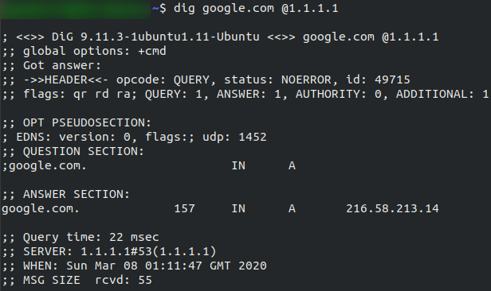

# Introduction
There are different sets of hardware and software solutions to achieve security goals.

Hardware examples:
- **Firewall** appliance - Allows or blocks connections based on predefined rules.
- **Intrusion Detection System** (IDS) appliance - Detects system and network intrusions and intrusion attempts.
- **Intrusion Prevention System** (IPS) appliance - Blocks detected intrusions and intrusion attempts.
- **Virtual Private network** (VPN) concentrator appliance - Safeguards network traffic from third-party interference, ensuring confidentiality and integrity of data transmission.

Software examples:
- **Antivirus software** - Detects and blocks malicious files from executing
- **Host Firewall** - A host firewall, unlike a firewall appliance, is a software program integrated into or installed on a system. (eg. Windows Defender Firewall)

# Methodology
Breaking into a target network is usually done in these seven steps.

1. **Recon**: Attacker gathers information about the target, including servers, operating system, IP addresses, and user details.
2. **Weaponization**: Malicious components are prepared for remote access.
3. **Delivery**: Malware is delivered to the target via email or USB flash drive.
4. **Exploitation**: Malicious file is opened, allowing execution of its components.
5. **Installation**: Malware is installed on the target system.
6. **Command & Control (C2)**: Attacker gains control over the target system.
7. **Actions on Objectives**: Attacker achieves objectives, such as data exfiltration, after gaining control.

# Networking Tools
### Ping
Pings work using the ICMP protocol, it is a slightly less well-known TCP/IP protocols.
It works on the ***network*** layer (**OSI**) / ***Internet*** layer (**TCP/IP**).
### Traceroute
In order to get to the content you want you often have to go though many servers,
using traceroute we can see every intermediate step between your computer and the requested resource.
###### Syntax:
**Linux**: `traceroute <destination>` | **Windows**: `tracert <destination>`
By default the Unix version operates on the **UDP** protocol Windows uses the **ICMP** protocol.
(these both can be switched)
### WHOIS
Domain names translate into IP addresses, these domains are leased out by companies called **Domain Registrars**.

WhoIs allows you to query who owns a given domain. (inside Europe the personal details are redacted)
###### Syntax:
`whois <domain>`
### Dig
Dig allows us to manually query recursive DNS servers of our choice for information on domains, often used for network troubleshooting.
###### Syntax:
`dig <domain> @<dns-server-ip>`

Example output:

this send 1 query, received 1 answer.
157 here it the TTL or Time To Live (in seconds)- this is how long it takes for our computer to stop considering it valid and removing it from the cache.

---
[[Study notes/Networks/Networking|Networking]] | [[LAN Networks]]