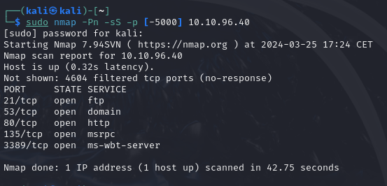

More detailed info in [[Networking]]
## Scan Types
- TCP Connect Scans `-sT`
- SYN "Half-open" Scans `-sS`
- UDP Scans `-sU`
--less common ones are:
- TCP Null Scans `-sN`
- TCP FIN Scans `-sF`
- TCP Xmas Scans `-sX`

### TCP Connect Scans
These work based on, as the name suggests on the TCP Connect *three-way handshake*.
nmap tries to connect and determines whether the service is open or not by the response.

(see: [RFC 9293](https://datatracker.ietf.org/doc/html/rfc9293) for details)
If Nmap sends a TCP request with a set SYN flag to a closed port, target will respond with a TCP packet and a **RST** (Reset) flag set, this way Nmap establishes the port is closed.

if the port is open the target will respond with the standard SYN/ACK flags set.

If the request is simply dropped and there is no response at all, it is protected by a firewall these ports are then considered *filtered*.

It is also possible to configure the firewall to response with a RST TCP packet, making it difficult to get accurate readings of the target.

Example
`iptables -I INPUT -p tcp --dport <port> -j REJECT --reject-with tcp-reset`

### SYN "Half-open" Scans
SYN scans ( `-sS` ) are used to scan the TCP port-range, they are often referred to as "Half-open" or "Stealth" scans.
When performing the three-way handshake with the target, SYN scans send a **RST** (Reset) TCP packet instead of ACK to prevent the server from repeatedly trying to make requests.

they are considered stealthy because:
- **IDS** (Intrusion Detection Systems) often look out for three-way handshakes so this usually does not get detected as easy.
- These scans are often not logged by the target as they log once a connection has been established, which this does not by sending RST at the end.

They also have an extra advantage of being significantly faster than standard TCPs.

It does have 2 disadvantages namely
1. They require *sudo* permissions to work correctly in Linux.
2. Unstable services can be brought down by SYN scans.

Because of these advantages Nmap will default to this if ran with sudo permissions, otherwise it defaults to TCP connect scans

### UDP Scans
UDP connections don't work with the handshake as previous scans, rather UDP connections are stateless.

When Nmap sends a package to a UDP port it expects no response for `open|filtered` results, if it does get a UDP response (although rare) it will be marked as `open`.

When a package is sent to a closed UDP port it should respond with a ICMP (ping) packet, with the message that the port is unreachable.

UDP scans tend to be incredibly slow compared to TCP scans (around 20~ minutes for first 1000 ports). so when using it you'll most likely want to focus on something like the top20 common UDP ports
example: `nmap -sU --top-ports 20 <target>`

By default Nmap sends empty UDP requests, except for ports with well known services where it will send protocol-specific payloads to increase chances of a valid response.

### NULL, FIN, XMAS Scans
All three are commonly less used and are primarily used where extra stealth is required (even more "stealthy" than SYN) or for Firewall Evasion

**NULL Scans** ( `-sN` ) are where the TCP request is sent with no flags set at all, target host should respond with a RST if port is closed.

**FIN Scans** ( `-sF` ) similar to above but set the FIN flag (usually used to gracefully close active connections) Nmap expects RST if port is closed.

**Xmas Scan** ( `-sX` ) sends a malformed TCP packet, expects a RST response for closed ports.
Called that because it looks like an Xmas tree in wireshark packet capture
Sets the PSH, URG and FIN flags

the expected response for *open* ports is similar to that of the UDP scan.
the ports should identify as either `open|filtered`, `closed` or `filtered` 
Most modern IDS solutions are savvy to these scan types so don't rely on them being 100% effective.
Microsoft Windows (and a lot of Cisco network devices) are known to respond with a RST to any malformed TCP packet -- regardless of whether the port is actually open or not. This results in all ports showing up as being closed.
### ICMP Network Scanning
When working on a black box assignment, we first want to "map" the network structure, see which IP addresses contain active hosts.

One way to do this is by performing an Nmap "ping sweep", Nmap sends an ICMP packet to  each possible IP address in the given network, if the IP responds it's marked.

sweep example to scan the `192.168.0.x` network, we can use the hypen (`-`) or CIDR notation:
`nmap -sn 192.168.0.1-254` or `nmap -sn 192.168.0.0/24`

the `-sn` switch tells Nmap not to scan any ports so it is forced to use ICMP echo packets (or ARP requests on local networks if ran as sudo)

CIDR Notation:

### NSE Scripts - Overview
Nmap Scripting Engine (NSE) is an addition to Nmap, they are written in Lua.
They can be used to scan vulnerabilities and automatically exploiting them.

There are several categories available:
- `safe` - Won't affect the target
- `intrusive` - Not safe, likely to affect the target
- `vuln` - Scan for vulnerabilities
- `exploit` - Attempt to exploit vulnerability
- `auth` - Attempt to bypass authentication for running services (e.g. Log into FTP server anonymously)
- `brute` - Attempts to bruteforce credentials for running services
- `discovery` - Attempts to query running services for further info about the network (e.g. query a SNMP server).

[More exhaustive list here](https://nmap.org/book/nse-usage.html)

----

to run a specific script we would use `--script=<script-name>` or multiple scripts separated by comma example: `--script=smb-enum-users,smb-enum-shares`.
some scripts require arguments for example the `http-put` script takes 2 arguments, the url where to upload the file to, and the path to the file locally.
example: `nmap -p 80 --script http-put --script-args http-put.url='<target-url>', http-put.file='./shell.php'`

[full script list here](https://nmap.org/nsedoc/)

Locally scripts are stored in `/usr/share/nmap/scripts` and  `/usr/share/nmap/scripts/scripts.db` which despite the extension is just a formatted text file.

Finding specific scripts you can do by either
`grep "ftp" /usr/share/nmap/scripts/script.db`
or
`ls -l /usr/share/nmap/scripts/*ftp*`

Manually installing scripts is done through:
`sudo wget -O /usr/share/nmap/scripts/<script-name>.nse https://svn.nmap.org/nmap/scripts/<script-name>.nse`
This must then be followed up with `nmap --script-updatedb`, which updates the `script.db` file to contain the newly downloaded script.
### Firewall Evasion
Typical Windows hosts will with default firewall, block all ICMP packets.
Nmap does this be default when checking hosts, so it will register the host as "dead".
To get around this we use `-Pn` telling Nmap to not bother pinging before scanning

If you are already on the network Nmap can also use ARP requests, to determine host activity.

The following switches can be useful to evade a firewall:
- `-f`: Fragments packets into smaller pieces so they are less likely to get detected by firewall or IDS
- `--mtu <number>`: provides control over the packet size, must be a multiple of 8.
- `--badsum`: used to generate an invalid checksum, real TCP/IP stacks would drop this packet, firewalls may respond automatically without bothering to check the checksum. thus this can be used to check for the presence of a firewall/IDS.

---
### Practical

==Does the target ip respond to ICMP echo (ping) requests (Y/N)?==
- No

==Perform an Xmas scan on the first 999 ports of the target -- how many ports are shown to be open or filtered?==
- 999
==Reason?==
- "no-response"

==Perform a TCP SYN scan on the first 5000 ports of the target -- how many ports are shown to be open?==
- 5

For the next question, monitor the requests with WireShark.
==Deploy the `ftp-anon` script against the box. Can Nmap login successfully to the FTP server on port 21? (Y/N)==
- Y

We can see the response highlighter here saying "Logged on"
