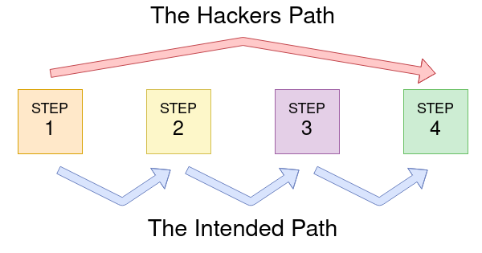

# Username Enumeration
Website error messages are very good for collecting information to build up a list of valid usernames.
e.g. When you make a new account you might get "An account with this username already exists"

ffuf example:
```shell
ffuf -w /usr/share/wordlists/seclists/Usernames/Names/names.txt -X POST -d "username=FUZZ&email=x&password=x&cpassword=x" -H "Content-Type: application/x-www-form-urlencoded" -u http://10.10.48.85/customers/signup -mr "username already exists"
```


In the example, the **-w argument** specifies the location of the file containing the list of usernames to check.

The **-X argument** determines the request method; in this case, it's a **POST request**.

The **-d argument** specifies the data being sent, including fields like username, email, password, and cpassword.

The **FUZZ keyword** in ffuf signifies where contents from the wordlist are inserted in the request.

The **-H argument** adds additional headers, such as setting **Content-Type** for sending form data.

The **-u argument** specifies the URL for the request, and **-mr argument** looks for specific text on the page to validate the discovery of a valid username.
# Brute Force
A brute force attack is an automated process, trying a list of common passwords against a single username or a list of usernames.

**ffuf example:** (building on previous section)

```shell
ffuf -w tmp_users.txt:W1,/usr/share/wordlists/seclists/Passwords/Common-Credentials/10-million-password-list-top-100.txt:W2 -X POST -d "username=W1&password=W2" -H "Content-Type: application/x-www-form-urlencoded" -u http://10.10.48.85/customers/login -fc 200
```

This **ffuf command** involves using **multiple wordlists**.

Instead of relying on the **FUZZ keyword**, we specify our own keywords (**W1** for usernames and **W2** for passwords).

The **-w argument** is used to specify the multiple wordlists, separated by commas.

To check for a positive match, the **-fc argument** is used to verify an **HTTP status code** other than 200.


# Logic Flaw
A logic flaw occurs when the typical logical flow of an application is bypassed, circumvented, or manipulated by a hacker. While logic flaws can exist in any area of a website, this instance focuses on examples related to authentication.

**Example**:

```php
if( url.substr(0,6) === '/admin') {
    # Code to check user is an admin
} else {
    # View Page
}
```

In the provided PHP code, authentication checks are performed based on the URL path. However, a logic flaw arises because the code does not account for variations in letter casing. As a result, unauthenticated users can bypass authentication checks by requesting paths with different letter casing, such as `/adMin`.



## Practical example
Taking a look at the "Reset Password" option on 'acmeitsupport' 
This assumes we have our own test user we made earlier - 'sawa' in my case

Using 'robert' as an example user:

Curl request;
```shell
curl 'http://10.10.48.85/customers/reset?email=robert%40acmeitsupport.thm' -H 'Content-Type: application/x-www-form-urlencoded' -d 'username=robert'
```

Output;


but what if we can set the email itself in our POST form?;
```shell
curl 'http://10.10.48.85/customers/reset?email=robert%40acmeitsupport.thm' -H 'Content-Type: application/x-www-form-urlencoded' -d 'username=robert&email=sawa@customer.acmeitsupport.thm'
```

output - (no css)


now on the website we got a ticket with a link, which we can use to login as robert.

# Cookie Tampering

Cookies usually exist in either plain text or hashed
## Plaintext


## Hashing

Sometimes cookie values can look like a long string of random characters; these are called hashes which are an irreversible representation of the original text, but they will always be the same if the input is the same.
(helpful service for this; https://crackstation.net/ )

Here are some examples that you may come across:

| **Original** | **Hash Method** | **Output**                                                                                                                       |
| ------------ | --------------- | -------------------------------------------------------------------------------------------------------------------------------- |
| 1            | md5             | c4ca4238a0b923820dcc509a6f75849b                                                                                                 |
| 1            | sha-256         | 6b86b273ff34fce19d6b804eff5a3f5747ada4eaa22f1d49c01e52ddb7875b4b                                                                 |
| 1            | sha-512         | 4dff4ea340f0a823f15d3f4f01ab62eae0e5da579ccb851f8db9dfe84c58b2b37b89903a740e1ee172da793a6e79d560e5f7f9bd058a12a280433ed6fa46510a |
| 1            | sha1            | 356a192b7913b04c54574d18c28d46e6395428ab                                                                                         |

## Encoding
**Encoding** is reversible and allows conversion of binary data into human-readable text, suitable for transmission over mediums supporting plain text ASCII characters.

Common encoding types include **base32** and **base64**, which convert binary data into specific character sets.

For example, a string like `eyJpZCI6MSwiYWRtaW4iOmZhbHNlfQ==` in base64 decodes to `{"id":1,"admin": false}`. Modifying this value and re-encoding it allows for manipulation, such as setting the `admin` value to `true`, granting admin access.