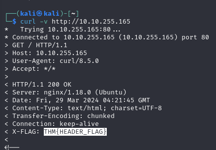
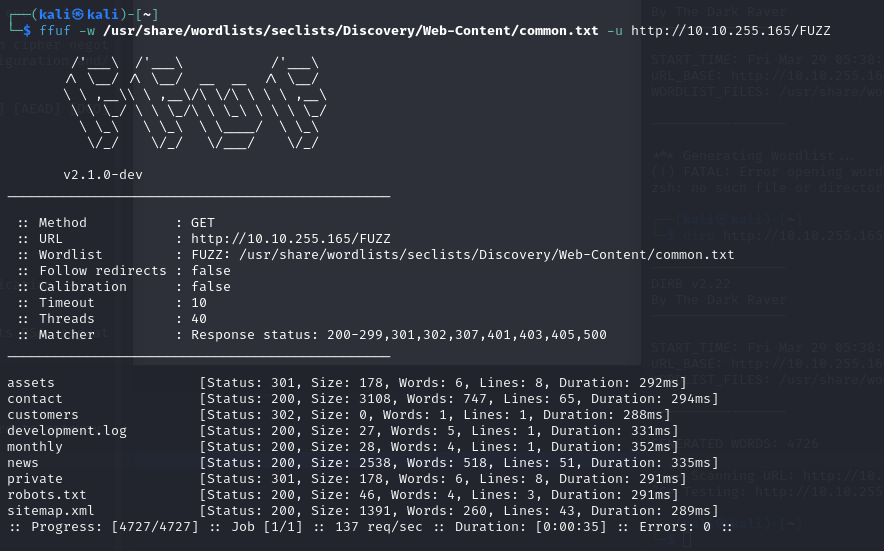

(No notes on **developer tools** built into Chrome / Firefox cause already knew those )
# Content Discovery

## Common pages/files

`/robots.txt` - tells search engines which pages they're not allowed to show on their search results

`images/favicon.ico` - (can be on a slightly different path) - Using a DB like https://wiki.owasp.org/index.php/OWASP_favicon_database We can see what framework if any, the website is built with
e.g.: 
```shell-session
curl https://static-labs.tryhackme.cloud/sites/favicon/images/favicon.ico | md5sum
```

`sitemap.xml` - lists all files the owner wishes to be public/available to search engines.

## HTTP Headers

Headers sometimes contain useful information about the webserver or so.
To see headers we can simply do: `curl -v http://[Target-website]`



## Framework stack
Once you've established what framework a site is built on, learning more about it through documentation or so can provide extra information that might to further discovery's

## OSINT - Google Hacking/Dorking
using Google's search engine features we can filter out certain content and find extra pages or files 

| **Filter** | **Example**        | **Description**                                              |
| ---------- | ------------------ | ------------------------------------------------------------ |
| site       | site:tryhackme.com | returns results only from the specified website address      |
| inurl      | inurl:admin        | returns results that have the specified word in the URL      |
| filetype   | filetype:pdf       | returns results which are a particular file extension        |
| intitle    | intitle:admin      | returns results that contain the specified word in the title |
More information about google hacking can be found here: [https://en.wikipedia.org/wiki/Google_hacking](https://en.wikipedia.org/wiki/Google_hacking)
## OSINT - Wappalyzer
Wappalyzer ([https://www.wappalyzer.com/](https://www.wappalyzer.com/)) is an online tool and browser extension that helps identify what technologies a website uses, such as frameworks, Content Management Systems (CMS), payment processors and much more, and it can even find version numbers as well.
## OSINT - Wayback Machine
The Wayback Machine ([https://archive.org/web/](https://archive.org/web/)) is a historical archive of websites that dates back to the late 90s. You can search a domain name, and it will show you all the times the service scraped the web page and saved the contents. This service can help uncover old pages that may still be active on the current website.

## OSINT - GitHub
**GitHub** is a hosted version of **Git** on the internet, facilitating **version control** for project files. Users commit changes with a message and push them to a central **repository**.

Repositories on GitHub can be **public or private** with **various access controls**.

GitHub's **search feature** allows users to locate repositories, potentially accessing source code, passwords, or other content.

## OSINT - S3 Buckets
**S3 Buckets** are a **storage service** provided by **Amazon AWS**, allowing users to store files and static website content in the cloud accessible over **HTTP** and **HTTPS**.

Owners can **set access permissions** to make files **public, private, or writable**.

**Incorrectly set access permissions** can inadvertently allow access to files that shouldn't be public.

The format of **S3 buckets** is http(s)://{name}.s3.amazonaws.com, where {name} is decided by the owner.

**S3 buckets** can be discovered by finding URLs in website page source, GitHub repositories, or through automation methods using common terms like {name}-assets, {name}-www, etc.
## Automated Discovery
**Automated Discovery** is the process of using **tools** to discover content instead of manual methods. This automated process involves numerous requests to a web server, checking for the existence of files or directories on a website and revealing previously unknown resources.

**Wordlists** are text files containing commonly used words, crucial for automated discovery. Different wordlists cater to various use cases; for content discovery, wordlists contain commonly used directory and file names. A recommended resource for wordlists is **SecLists**, curated by **Daniel Miessler** and available at [https://github.com/danielmiessler/SecLists](https://github.com/danielmiessler/SecLists).

**Automation Tools** such as **ffuf**, **dirb**, and **gobuster** are commonly used for content discovery, each with its features and limitations.

**Using ffuf:**
`ffuf -w /usr/share/wordlists/seclists/Discovery/Web-Content/common.txt -u http://10.10.255.165/FUZZ`



**Using dirb:**
`dirb http://10.10.255.165/ /usr/share/wordlists/seclists/Discovery/Web-Content/common.txt`

**Using Gobuster:**
`gobuster dir --url http://10.10.255.165/ -w /usr/share/wordlists/seclists/Discovery/Web-Content/common.txt`


---
