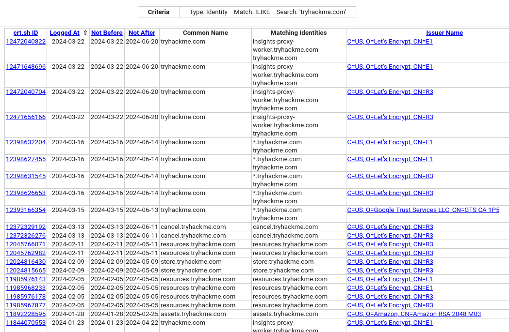
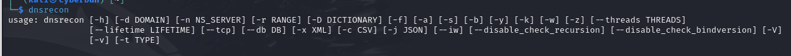
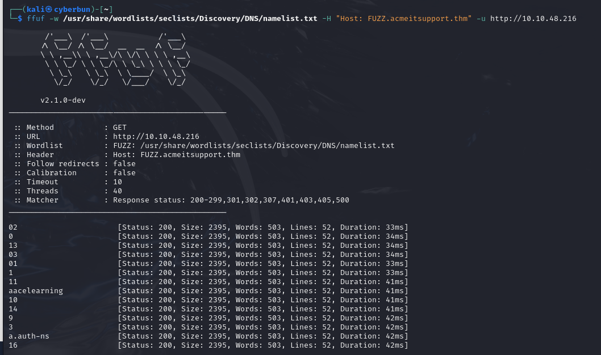
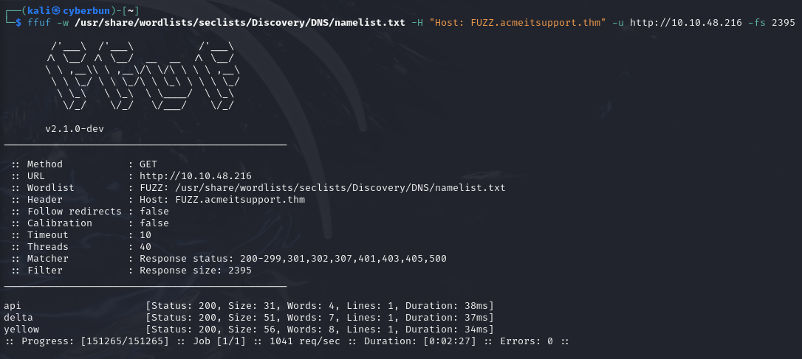

# Subdomain Enumeration
There's 3 different subdomain enumeration methods:
- **Brute Force**
- **OSINT (Open-Source Intelligence)**
- **Virtual Host**

## OSINT - SSL/TLS Certificates
SSL/TLS Certificates (**Secure Socket Layer / Transport Layer Security**) are created for a domain by a CA (Certificate Authority). Their CT (Certificate Transparency) logs are publicly accessible.
This service can be used to discover subdomains belonging to the same domain

Searchable Databases for this:
- https://crt.sh/
- https://ui.ctsearch.entrust.com/ui/ctsearchui

An example - crt.sh :

## OSINT - Search Engines
Also known as "Google Dorking" - Google has 'advanced search methods' such as the `site: ` filter, can narrow the search results. For example, `-site:www.domain.com site:*.domain.com` would only contain results leading to the domain name domain.com but exclude any links to www.domain.com; 
## DNS Bruteforce
**Bruteforce DNS enumeration** involves trying numerous possible subdomains from a predefined list of commonly used ones. Due to the large number of requests involved, **automation with tools** is necessary to expedite the process.
e.g. Using `dnsrecon`;

## Automating OSINT - Sublist3r
To speed up the process of OSINT subdomain discovery, we can automate the above methods with the help of tools like [Sublist3r](https://github.com/aboul3la/Sublist3r).
## Virtual Hosts
**Subdomains** may not always be publicly accessible in DNS results, as they could be hosted on private DNS servers or recorded in developers' local host files.

Web servers can host multiple websites from one server, utilizing the **Host header** to determine the requested website. By modifying the **Host header** and monitoring the response, new websites can be discovered.

Similar to DNS Bruteforce, this process can be automated using a **wordlist** of commonly used subdomains.

The command uses the **-w switch** to specify the **wordlist** and the **-H switch** to add/edit a header (in this case, the Host header). The **FUZZ keyword** is used in place of a subdomain, where options from the wordlist are tried.

To filter the output, the **-fs switch** is used with the **page size result**, replacing {size} with the most occurring size value from the previous result. (2395 in this case).
This results in `ffuf` ignoring any results with the given size.

